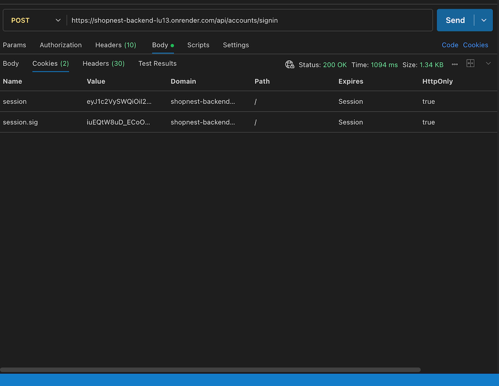
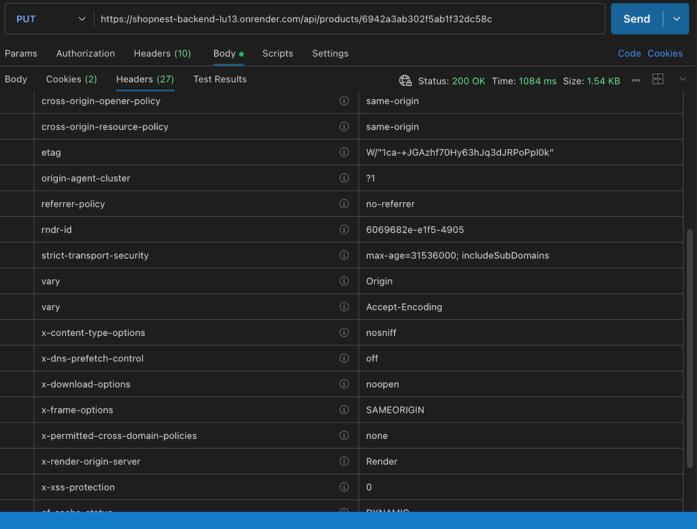
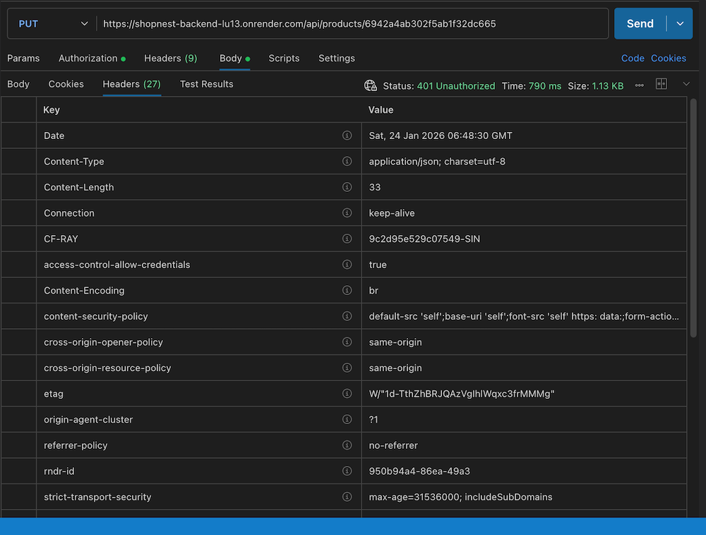
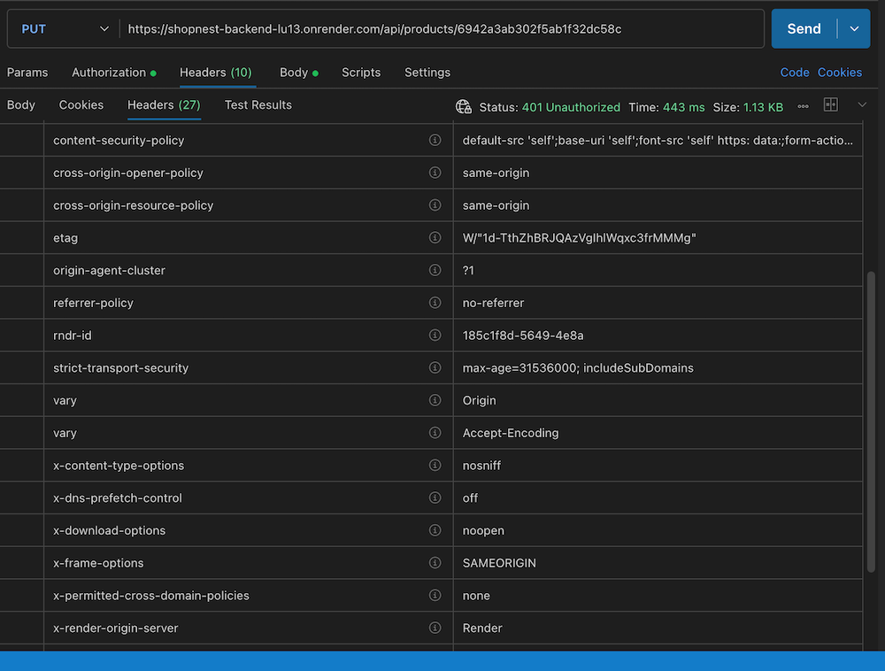
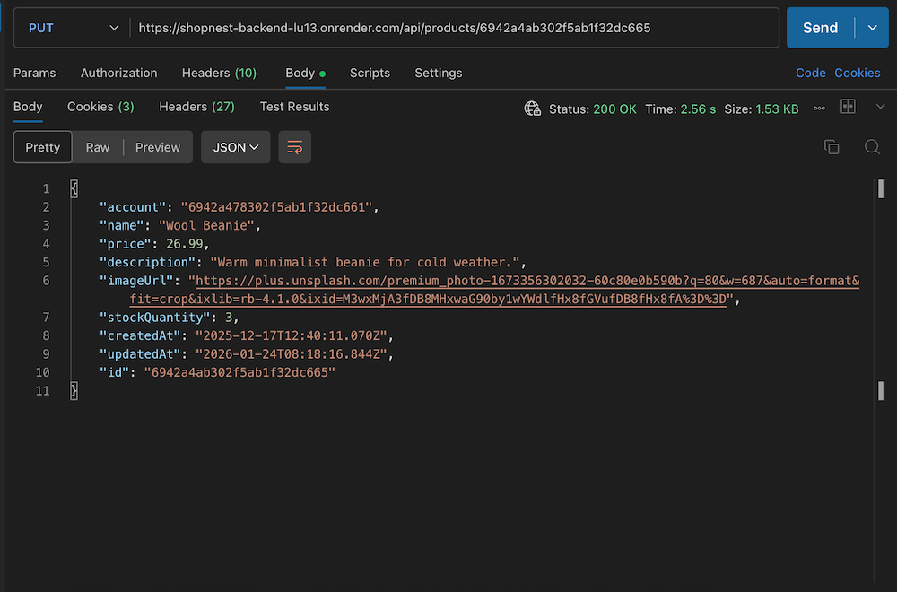
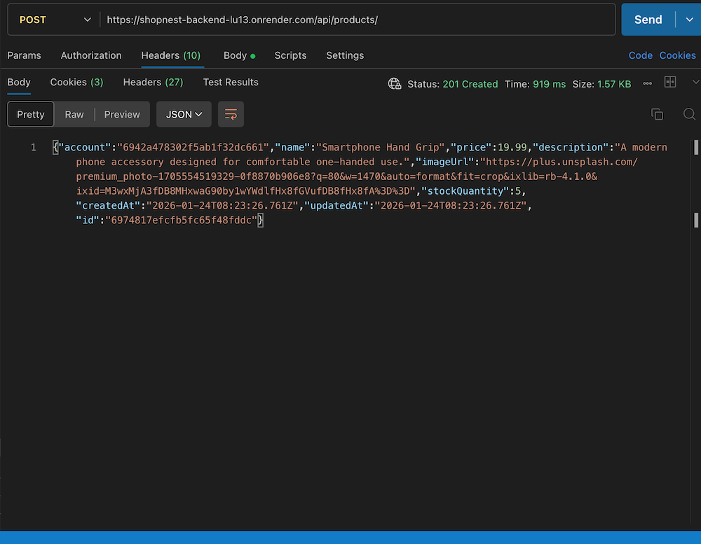

# ShopNest — Backend API

Production-minded backend for a full-stack e-commerce web application, built with **Node.js, Express, and MongoDB**.  
Designed from a **merchant-first perspective**, with secure authentication, product management, and a customer shopping cart flow.

---

## Overview

ShopNest supports two primary user flows:

- **Merchants / Sellers** can sign up, authenticate, and manage products through full CRUD operations.
- **Customers / Clients** can browse products without an account and add items to a persistent shopping cart.

The backend treats the **database as the source of truth**, and frontend state is derived entirely from backend responses and validations. This backend is intended to demonstrate production-minded API design rather than a feature-complete e-commerce platform.

> This project emphasizes **data integrity, validation, security, and deployment considerations**, rather than a fully completed checkout system. 

---

## Current Feature Set

### Merchant / Seller Capabilities
- Cookie-based session authentication
- Account creation with database-generated IDs
- Product CRUD operations (create, update, delete, list)
- Ownership enforcement (merchants can only modify their own products)
- Validation feedback for common errors:
  - duplicate email
  - missing or invalid fields
  - malformed input

### Customer / Client Capabilities
- Browse products without creating an account
- Add items to a shopping cart
- Cart persists across sessions
- Inventory constraints enforced during cart interactions

---

## Current Scope & Known Limitations

This backend intentionally stops short of a full checkout pipeline.

- When a customer submits a request:
  - the cart is cleared
  - inventory values are reset
- No payment processing or order lifecycle is implemented
- Out-of-stock handling is functional but minimal

These areas are **explicitly planned for future iterations**, and the current design leaves room for:
- persistent order records
- inventory locking
- transactional stock updates
- payment integration

---

## Tech Stack

### Core
- **Node.js**
- **Express 5**
- **MongoDB**
- **Mongoose**

### Authentication & Validation
- **cookie-session** – session-based authentication
- **cookie-parser**
- **express-validator** – request-level validation

### Security & Reliability
- **Helmet** – secure HTTP headers
- **express-rate-limit** – throttling sensitive endpoints
- **CORS** – controlled frontend/backend communication

### Configuration & Tooling
- **dotenv** – environment-based configuration
- **nodemon** – local development workflow

---

## Architecture & Design

The backend follows a modular structure with clear separation of concerns.

**High-level request flow:**

Route → Validation → Authentication → Controller → Model → Response

### Design Principles
- Validation at multiple layers (API + database)
- Business rules enforced server-side
- Stateless frontend, backend-driven state
- Clear boundaries between routing, logic, and persistence

---

## Data Integrity & Validation Strategy

- **Request validation** prevents malformed input from reaching the database
- **Schema constraints** enforce long-term data consistency
- **Controller logic** enforces business rules (ownership, inventory limits)

This layered approach ensures frontend state accurately reflects backend reality.

---

## Deployment & Infrastructure

The backend is deployed using **Render** on a free tier.

### Deployment Considerations
- Environment variables managed via Render dashboard
- MongoDB connection configured for cloud deployment
- Middleware ordering carefully structured for production behavior

### Free-Tier Constraints (Handled Intentionally)
- Render services may enter sleep mode during inactivity
- Application logic is structured to **minimize unnecessary database wake-ups**
- Lightweight routes reduce cold-start impact

These constraints influenced architectural decisions and reinforced a focus on **efficient request handling**.

---

### Live Application & Repositories

**Live Website**  
https://shopnest-frontend-tan.vercel.app/

> Note: This service is hosted on a free tier. The first request after inactivity may experience a brief cold start.

**Frontend Repository**  
https://github.com/Miguel-Venegas/shopnest-frontend

**Backend API**  
https://shopnest-backend-lu13.onrender.com

**Health Check**  
GET https://shopnest-backend-lu13.onrender.com/health
→ { "ok": true }

---

## Frontend Integration

The frontend does not maintain authoritative state; all critical state transitions are validated and persisted by the backend.

- UI state mirrors backend responses
- Validation feedback is surfaced directly to users
- Cart persistence and inventory constraints are enforced server-side

---

## API Behavior Examples

### Authentication & Sessions

#### Successful merchant sign-in returns a signed session cookie.
Authentication is handled via cookie-based sessions, with security headers and rate limiting enforced at the API layer.

#### The backend recognizes the session on subsequent requests

#### Authorization Enforcement
Authorization is enforced server-side, not assumed client-side.

#### Ownership Enforcement
Ensures merchants can only access and manage resources they own, preventing unauthorized reads or mutations across accounts.

#### CRUD Operations
Supports full create, read, update, and delete workflows with server-side validation and role-aware access control.

##### Update Example
Demonstrates partial updates with validation, returning the updated resource while preserving unchanged fields.

##### Create Example
Safely creates a resource under the authenticated merchant account, returning a confirmation response on success.

##### Database as Source of Truth
The frontend UI automatically reflects products created via the API, confirming the database as the single source of truth.  

## Roadmap

Future enhancements include:
- Persistent order records
- Inventory locking and transactional updates
- Expanded out-of-stock handling
- Checkout and payment integration
